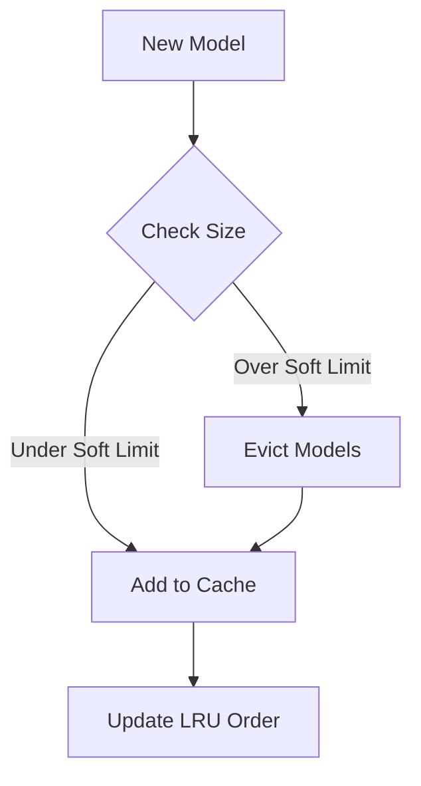
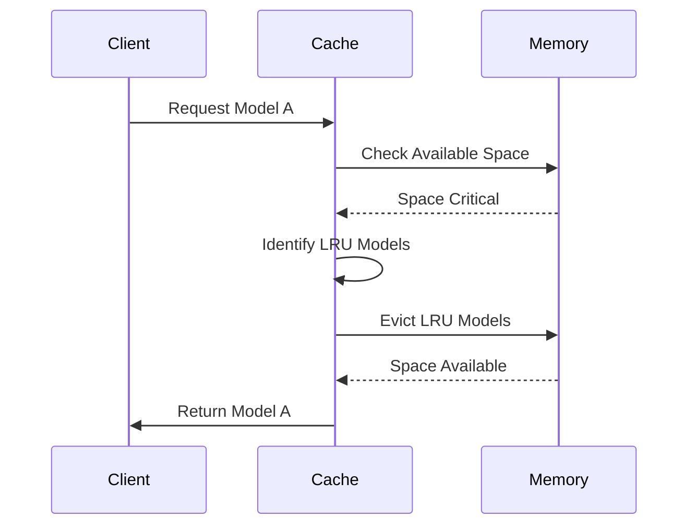
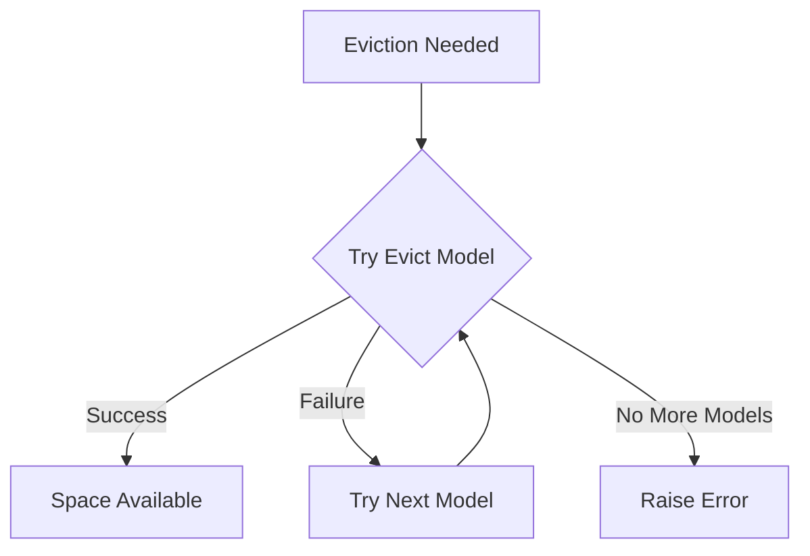

# Understanding Portfolio's LRU Cache System

## Overview
Portfolio uses a Least Recently Used (LRU) cache to efficiently manage machine learning models in memory. This document explains how the cache works and what to expect when deploying models.

## Cache Behavior

### Memory Management
The cache uses two key thresholds:



- **Max Memory**: Hard limit that cannot be exceeded (e.g., 1GB)
- **Soft Limit**: Threshold triggering preemptive eviction (e.g., 800MB)

### Eviction Process
When memory pressure occurs:

1. Least recently used models are identified
2. Models are evicted until enough space is available
3. Access times are tracked per model



### Example Scenarios

#### Scenario 1: Normal Operation
```plaintext
Cache State (1GB max, 800MB soft limit):
Model A: 300MB (Last used: 2min ago)
Model B: 400MB (Last used: 5min ago)
Total: 700MB (Under soft limit)
```

#### Scenario 2: Soft Limit Trigger
```plaintext
Adding Model C (200MB):
Total would be: 900MB
Action: Allowed but triggers preemptive cleanup
Result: Model B evicted (least recently used)
```

## Important Behaviors

### Model Sizing
- Models must declare their memory size upfront
- Size includes model weights and runtime memory
- FIXME: Add runtime memory estimation

### Access Patterns
The cache updates access times on:
- Model loading
- Inference requests
- Explicit refreshes

### Edge Cases

1. **Large Models**
- Models larger than soft limit but under max limit are allowed
- May trigger aggressive eviction
- TODO: Add warning system for large models

2. **High Concurrency**
- Cache is thread-safe
- Uses atomic operations for size tracking
- Multiple evictions may occur under heavy load

3. **Failed Evictions**


## Best Practices

1. **Model Sizing**
- Set realistic memory estimates
- Include buffer for runtime variations
- Monitor actual usage

2. **Configuration**
```yaml
cache:
  max_memory: "1GB"    # Hard limit
  soft_limit: "800MB"  # Eviction trigger
  ttl: 3600           # Optional time-based eviction
```

3. **Monitoring**
- Watch for frequent evictions
- Monitor cache hit/miss ratios
- Track model access patterns

## Common Issues

### Problem: Frequent Evictions
```plaintext
Symptom: Models constantly being evicted
Cause: Cache too small or too many large models
Solution: Increase cache size or reduce model count
```

### Problem: Memory Spikes
```plaintext
Symptom: OOM errors despite cache limits
Cause: Runtime memory not accounted for
Solution: Add memory overhead estimate
```

## Future Improvements
1. Dynamic memory estimation
2. Predictive preloading
3. Priority-based eviction
4. Distributed caching support

FIXME: Implement memory usage tracking hooks
TODO: Add cache warming capabilities
