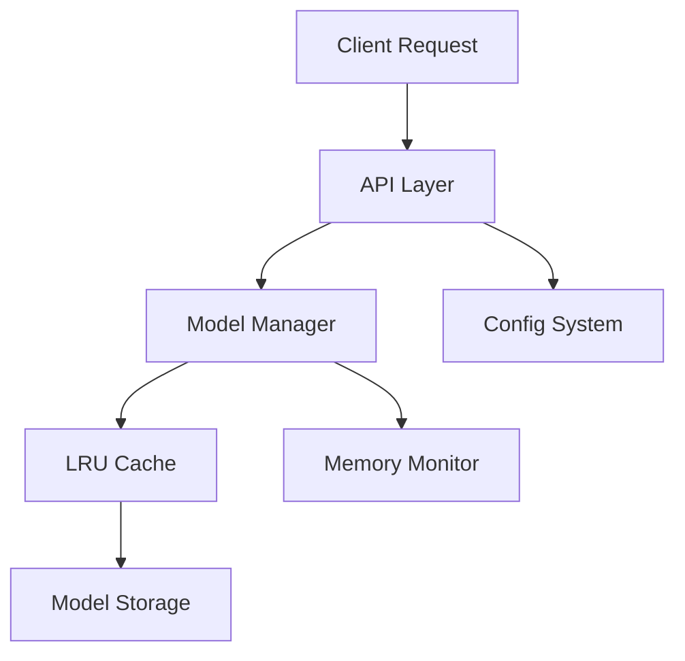

# Portfolio: LRU-based Machine Learning Model Server

## Overview
Portfolio is a FastAPI-based model server designed to efficiently serve machine learning models while intelligently managing memory usage through an LRU (Least Recently Used) caching mechanism.

## Goals
- Provide a fast, reliable API for serving ML models
- Efficiently manage memory usage through smart model loading/unloading
- Configuration-driven setup for easy deployment
- Support multiple model types and formats
- Monitor model usage and performance

## System Design
The system uses a layered architecture separating concerns while maintaining efficient communication:



### Core Components

#### API Layer
- FastAPI endpoints for model inference and metadata
- Authentication and rate limiting
- Health checks and monitoring

#### Model Manager & Cache
- Model lifecycle management (loading/unloading)
- LRU caching with timestamp tracking and frequency counters
- Usage metrics and memory monitoring
- Pre-loading of frequent models
- Version control support

#### Model Loader
- Abstracted interface supporting multiple formats:
  - PyTorch (JIT/state_dict), TensorFlow, ONNX
  - Scikit-learn, HuggingFace Transformers
  - Custom formats
- Format detection and validation
- Version control integration

#### Processing Pipeline
- Input/output validation and normalization
- Batch processing and tensor operations
- Data type conversions and transformations

#### Storage Layer
- Abstract backend interface supporting:
  - Local filesystem
  - Cloud storage (S3, GCS, Azure)
- Model versioning and metadata
- Caching interface

#### Resource Management
- CPU/GPU allocation and monitoring
- Memory profiling and quota enforcement
- Load balancing
- Dependency and environment management

#### Background Tasks
- Async model loading/unloading
- Cache maintenance and metrics collection
- Health checks and storage cleanup

#### Configuration
YAML-based settings for:
```yaml
models:
  model1:
    path: /models/model1
    type: pytorch
    memory_estimate: 2GB
    preload: true

cache:
  max_memory: 8GB
  soft_limit: 7GB
  ttl: 3600
```

### API Endpoints
```python
POST /v1/models/{model_id}/predict
GET /v1/models/{model_id}/metadata
GET /v1/models/status
GET /v1/health
```

### Memory Management
- Soft limit triggers background unloading
- Hard limit forces immediate unloading
- Per-model and system memory tracking

### Model Loading
1. On-demand loading
2. Preloading specified models
3. Background predictive loading
4. Version-aware updates

### Monitoring
- Memory usage, model latency, cache stats
- System health and error tracking
- Request tracing with OpenTelemetry

### Key Features
- Async non-blocking operations
- Batch prediction support
- Model optimization
- Memory management
- Input validation and security
- Horizontal scaling support

### Future Enhancements
1. Distributed serving
2. Enhanced GPU support
3. A/B testing
4. Model ensembles
5. Auto-scaling
